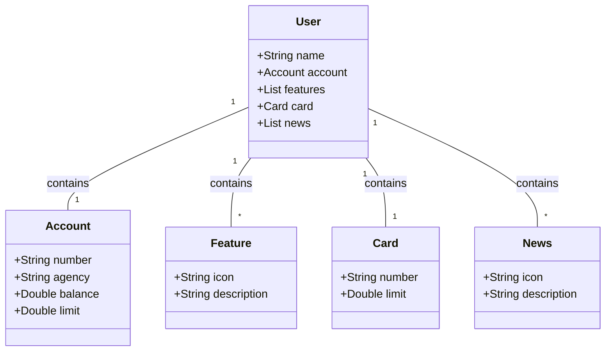

# Bootcamp Santander + DIO Back-end Java - 2024
Java RESTful API criada como projeto final do Bootcamp.

## Diagrama de Classes

```mermaid
classDiagram
    class User {
        +String name
        +Account account
        +List<Feature> features
        +Card card
        +List<News> news
    }

    class Account {
        +String number
        +String agency
        +Double balance
        +Double limit
    }

    class Feature {
        +String icon
        +String description
    }

    class Card {
        +String number
        +Double limit
    }

    class News {
        +String icon
        +String description
    }

    User "1" -- "1" Account : contains
    User "1" -- "*" Feature : contains
    User "1" -- "1" Card : contains
    User "1" -- "*" News : contains

```
